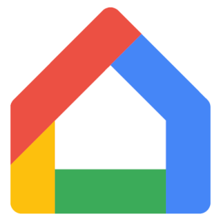

# ioBroker.google-smart-home-fulfillment

## google-smart-home-fulfillment adapter for ioBroker

### Caveats

**This software is currently cosidered Beta test quality. Use at your own risk.**

**Setup of this adapter requires some technical knowledge.** If you are looking or a way to connect an ioBroker instance with Google Assistant consider the [ioBroker.iot](https://github.com/ioBroker/ioBroker.iot) adapter. Pros & cons of each are briefly discussed below.

### Introduction

This adapter implements a Google Smart Home Actions fulfillment server running within an ioBroker installation. It creates devices in the Google ecosystem to mirror devices within the ioBroker object tree. These can be controller from any [Google Assistant](https://assistant.google.com/) device, smartphone running the Google Assistant app, etc.

#### Compared with ioBroker.iot

Benefits of this adapter over ioBroker.iot include:

- No (ioBroker Pro) [https://iobroker.pro/] subscription required. In fact, no subscriptions of any kind are necessary making this implementation completely free.
- Device configuration is automatic. Once the adapter is correctly up and running no further configuration is required.

Disadvantages:

- More complicated installation process (see below).
- Foreign adapter developers must create plugin code to allow their devices to used. Mapping between ioBroker/Google Home device types is necessary, and the philosophy here is that such mapping & translation should be performed in code on a per-foreign adapter basis. That is, foregin adapter developers should create a plugin for iobroker.google-smart-home-fulfillment which describes how devices in that foreign adapter map to devices in the Google Home and how commands and queries for each are serviced. While this requires more development effort, this philosophy actually leads to less configuration effort for the end user (an advantage above) and ultimately more flexibility how devices can be controlled.
- Given the above, a limited set of foregin adapters and device types are supported. Current foreign adapters are:
-- [ioBroker.Loxone](https://github.com/UncleSamSwiss/ioBroker.loxone)

Feel free to [submit a feature request issue](https://github.com/raintonr/ioBroker.google-smart-home-fulfillment/issues) for with plugin requests.

### Setup & Configuration

To use this adapter you will need to:

- Make sure there is a HTTPS server running within the ioBroker installation. Use [ioBroker.web](https://github.com/ioBroker/ioBroker.web) for this purpose.

- Visit the [Actions on Google Console](https://console.actions.google.com/).
-- Create a project that will be specifically used to communicate with this adapter instance. The project should be left in testing mode and not published.

TODO: and much more...

## Changelog

### 0.0.1
* (Robin Rainton) initial release

## License
MIT License

Copyright (c) 2020 Robin Rainton <robin@rainton.com>

Permission is hereby granted, free of charge, to any person obtaining a copy
of this software and associated documentation files (the "Software"), to deal
in the Software without restriction, including without limitation the rights
to use, copy, modify, merge, publish, distribute, sublicense, and/or sell
copies of the Software, and to permit persons to whom the Software is
furnished to do so, subject to the following conditions:

The above copyright notice and this permission notice shall be included in all
copies or substantial portions of the Software.

THE SOFTWARE IS PROVIDED "AS IS", WITHOUT WARRANTY OF ANY KIND, EXPRESS OR
IMPLIED, INCLUDING BUT NOT LIMITED TO THE WARRANTIES OF MERCHANTABILITY,
FITNESS FOR A PARTICULAR PURPOSE AND NONINFRINGEMENT. IN NO EVENT SHALL THE
AUTHORS OR COPYRIGHT HOLDERS BE LIABLE FOR ANY CLAIM, DAMAGES OR OTHER
LIABILITY, WHETHER IN AN ACTION OF CONTRACT, TORT OR OTHERWISE, ARISING FROM,
OUT OF OR IN CONNECTION WITH THE SOFTWARE OR THE USE OR OTHER DEALINGS IN THE
SOFTWARE.
